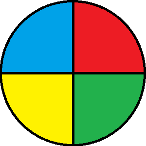

# Genius

## 📚 Índice 

- [Sobre](#-sobre)
- [Anexos](#-anexos)

---

## 📖 Sobre

Genius era um brinquedo muito popular na década de 1980 distribuído pela Brinquedos Estrela. O brinquedo buscava estimular a memorização de cores e sons. Com um formato semelhante a um OVNI, possuía botões coloridos que emitiam sons harmônicos e se iluminavam em seqüência.

---

## 📌 Anexos

